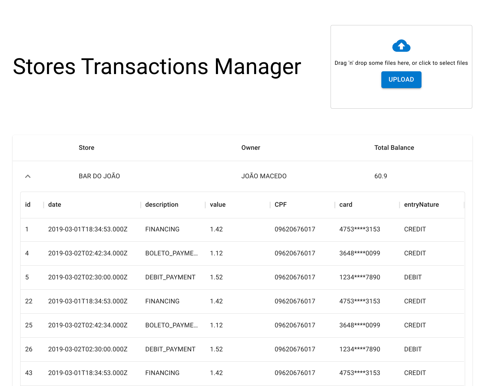

# Stores Transactions Manager

A simple software for managing transactions by uploading and parsing a CNAB file.

The Backend is built with NestJs, using Prisma ORM/(Postgres) as Database and the Frontend with Next.NestJs using MUI for UI components.

Ths repository has a minimal CI/CD setup via Github Actions, that automatically builds the application and deploys on Heroku.


## Screenshots




## Demo

Heroku will put the server on sleep after some time, so your first interaction with the demo will be a slower than normally

[Development](https://strs-transactions-manager-dev.herokuapp.com)
[Production](https://strs-transactions-manager.herokuapp.com)
## Run Development Env

Clone the project

```bash
  git clone https://github.com/enias-oliveira/stores-transactions-manager
```

```bash
  cd stores-transactions-manager
```

### Using Docker Compose

```bash
  docker-compose up
```

Web will be available on localhost:3000
Server on localhost:5500

### Run Locally

Go to the backend directory

```bash
  cd my-project
```

Go to the backend directory

```bash
  cd backend
```

Install dependencies

```bash
  npm install
```

Start the server

```bash
  npm run start
```

Go to the frontend directory

```bash
  cd ../frontend
```

Install dependencies

```bash
  npm install
```

Start the server

```bash
  npm run dev
```


Web will be available on localhost:3000
Server on localhost:5501


* There is support for Nix-shell, try it out, its awesome!
## API Reference

* The /api/ prefix is not required if fetching directly from the server, only if fetching via NextJs Frontend that acts as a proxy


#### Get all Stores

```http
  GET /api/stores
```

#### Get Store by id

```http
  GET /api/stores/${id}
```

#### Get Store Transactions

```http
  GET /api/stores/${id}/transactions
```

#### Get All Transactions

```http
  GET /api/transactions
```

#### Get All Transactions Types

```http
  GET /api/transactions
```


#### Upload Transactions File

```http
  POST /api/transactions/upload
```

* File must be send via multipart form 

| Parameter | Type     | Description                       |
| :-------- | :------- | :-------------------------------- |
| file      | `File` | **Required**. List of transactions following CNAB specification|


